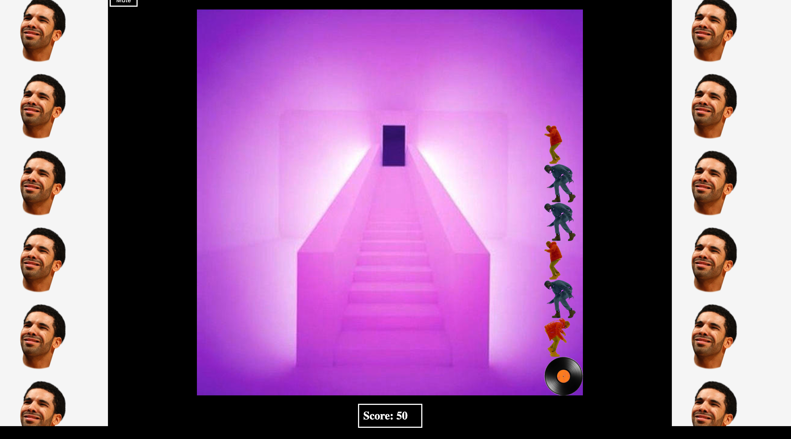
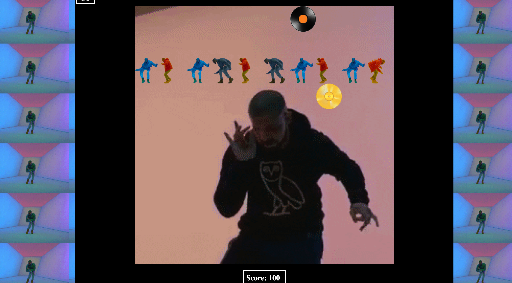
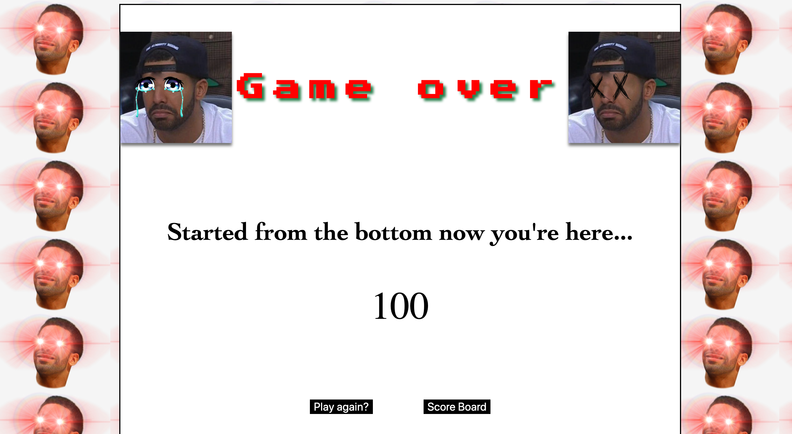
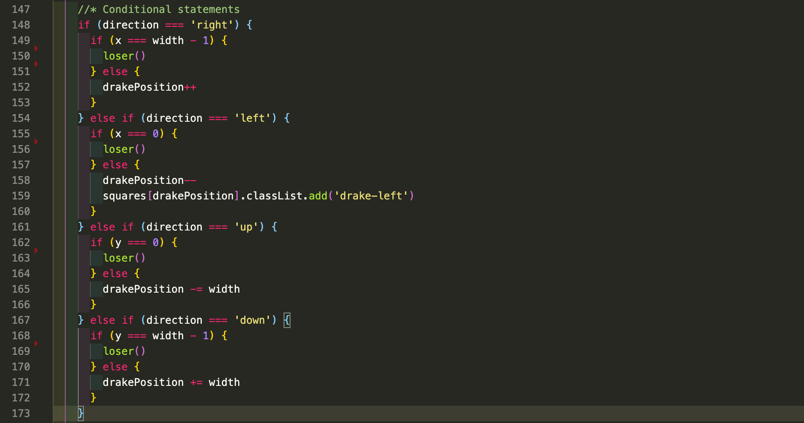
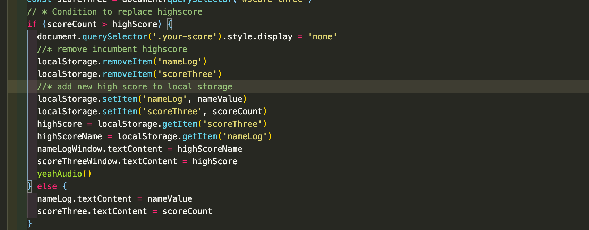
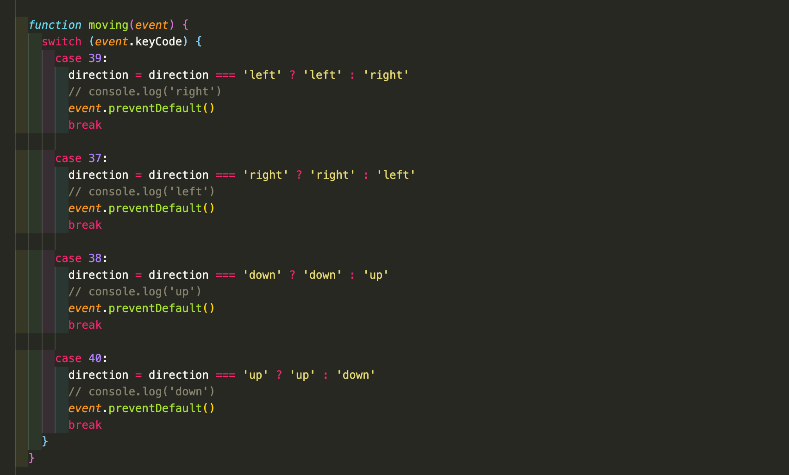

# **SEI Project one: Snake** (only its Drake!)

## **Overview.**

I'm sure many people reading this will remember the first time they played the legendary and timeless classic **'Snake'**. When looking at my options for my first project in my *General Assembly Software Engineering Immersive course* I was instantly drawn to putting my personal spin on a game that dominated my youth in the simpler days of the Nokia 3310.

I made the decision early on to turn my choice of *Snake* into a *Drake* themed version. Instead of eating food the idea is that *Drake* catches records and as he does his popularity increases, symbolised by the **Drake Snake** growing.

As mentioned above this was my first project with GA but also my first experience using HTML, CSS and Javascript to create a complete game in 8 days. Within this Readme I will outline my wins and struggles.

-----------------------

## **Brief.**

#### Project wide brief:

* **Render a game in the browser**
* **Design logic for winning** & **visually display which player won**
* **Include separate HTML / CSS / JavaScript files**
* Use **Javascript for **DOM manipulation**
* **Deploy your game online**, where the rest of the world can access it
* Use **semantic markup** for HTML and CSS (adhere to best practices)

#### Specific game brief:

* The *snake* should be able to eat food to grow bigger
* The game should end when the *snake* **hits the wall or itself**
* *Snake speeds up* as it eats more

#### Optional suggested enhancements:

* **Responsive design**
* **High score table**

-----------------------

## **Technologies used.**

#### Front End:

* **Javascript (ES5)**
* **HTML 5 with HTML 5 audio**
* **CSS3 with Keyframe animations**

#### Dev Tools:

* VScode
* Eslint
* Git
* GitHub
* Google Fonts
* Google Chrome dev tools

-----------------------

## **Approach.**

#### Grid Layout, Drake Snake Movement & Records: 

Initially I began with a 20 x 20 grid of divs generated by a createBoard function. This 20 x 20 grid was generated by a for loop creating divs restricted to the value of the width * width. Realising that a 20 x 20 grid will make the distance between the Drake Snake and the records potentially large I quickly adapted my CSS and JS to create a 10 x 10 grid for a better user experience. Using the width I then restricted Drakes movements along every axis.

Drakes movements within the grid are set in motion with a setInterval running at various speeds triggered by 3 difficulty buttons. Once in motion Drake is controlled by a switch statement linked to an keyUp event listener, this listens for the 'ASDW' keys with a default ignoring other keys. In addition to this I used Media Queries to include buttons as mobile friendly controls.

For my records (aka foods) I decided to use the Snake 2 model. For every tenth black record a golden record appears on 3 TimeOuts predetermined by the difficulty selected. Both records are generated by a Math.floor(Math.random). A while loop prevents any event where the randomised position would share any grid with another class.

#### Collisions:

The key concept and one of the biggest hurdles to overcome in this game is **collisions**. Using classList.contains I was able to create a condition where if the index of the Drake Snake's head was shared with any other part of the Drake Snake it calls on the end game logic. The second part of the collision logic came from adapting the restrictions around the board mentioned above. If the Drake Snake exceeds the boundaries of the grid the end game logic is once again called.

#### Audio:

Using a popular rap artist as my theme came with the benefit of a wealth of options for audio options. This came in handy when selecting adequate sounds to include in my game. I made the decision to play a snippet of the song 'Hotline Bling' along side Gifs of the viral music video to create a perfect **Golden record moment** I regulated this using the audio.play, and audio.pause in built functions. 

#### High Score Board:

Due to this project focusing purely on HTML, CSS and JS creating a fully functional High scores board wasn't feasible, however, using **window.localstorage** I was able to adapt a logic where if the user beats the high score currently stored within the localstorage they would be the new high score. This was achieved by storing the new high score and name in the local storage, then using getItem to pull the value from the local storage and manipulating a span using .textContent to present it on the screen. I also seized the opportunity to add a little easter egg. The incumbent high score holder is Aubrey Graham (Drake's real name).

-----------------------

## **Bugs.**

I have taken the time to play the game as much as possible. Numerous bugs have come up and I have been able to diagnose and rectify them using specific console logs to target the issue. The main bug I found occured when I neglected to reset the starting direction. So if the Drake Snake crashed whilst going left or up when it returned to index 0 to begin the next game it instantly died. I diagnosed this by using console logs specifying the direction the Drake Snake was going in.

-----------------------

## **Wins and Hurdles.**

#### Wins:

I am very happy with the CSS and DOM manipulations. I have displayed an ability to create something fun and light hearted for the user. There were also numerous pat-on-the-back moments in the JS logic like finally overcoming or understanding why something wasn't working.

#### Hurdles:

One of the biggest hurdles came from making the Drake Snake grow. I was able to increase the array of the snake visible in console logs however the index did not follow the head of the snake. This was solved by using unshift to move DrakePosition (the head of the snake) to the front each time then pop the last part of the snake. In the event that Drake reaches a record the grow snake function is called which then doesnt pop the last index of the snake.

Another hurdle was figuring out the logic to prevent the user from using opposite directions. I.e right to left and up to down. This was overcome by using a **ternary operator** to disable the user's ability to use opposite keys. This was an essential piece of logic to prevent bugs in the collision logic.

-----------------------

## **Takeaways.**

This was a good opportunity to learn how to use **JavaScript** as a full and functional app after months of practicing small disconnected functions. It also gave me the oppotunity to work to a schedule and ensure that I hit targets to ensure the game was ready for deployment on time. 

-----------------------